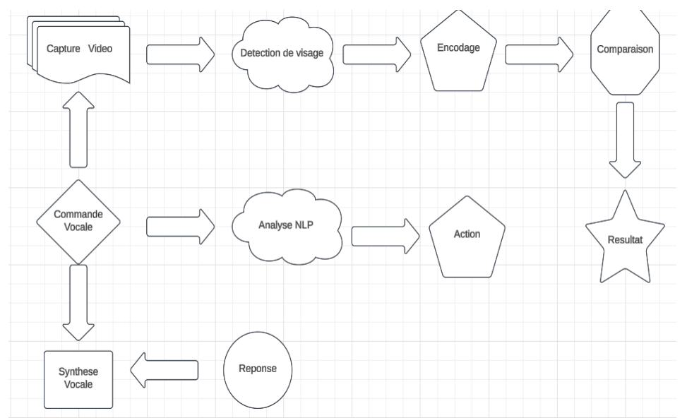
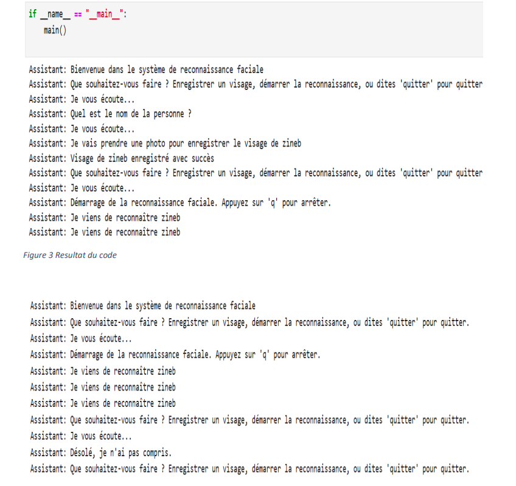

# Facial Recognition & NLP Integration 🤖🗣️

## Introduction
Facial recognition and Natural Language Processing (NLP) are two rapidly growing fields, offering immense possibilities in security, authentication, and human-machine interaction. This project explores the integration of these two technologies to create a system capable of recognizing faces while interacting with the user via voice commands.

The main objective of this project is to develop a Python system that combines **facial recognition** and **NLP** to provide an intuitive and effective user experience. Key technical challenges include face capture and encoding, real-time voice recognition, and semantic analysis of user commands.

---

## Why Facial Recognition & NLP are Important? 🔍💬
Facial recognition identifies and verifies individuals based on facial features, revolutionizing security systems, biometric authentication, and personalized user experiences. NLP allows machines to understand, interpret, and generate human language, enabling natural interactions with users.

Combining these technologies allows the creation of powerful, context-aware systems that can:
- Recognize users and personalize responses.
- Enhance security with voice and face verification.
- Offer interactive, intelligent assistants for homes, workplaces, or customer support.

---

## Project Objectives 🎯
1. **Reliable Facial Recognition**
   - Detect and encode faces in real-time using webcam input.
   - Allow adding new faces to a local database.
   - Ensure high accuracy under various conditions (lighting, angles, expressions).

2. **Integrate NLP**
   - Analyze and understand voice commands in French.
   - Implement an interactive voice interface with real-time feedback.

3. **Seamless Interaction**
   - Provide contextual voice responses based on face recognition results.
   - Enable commands to trigger actions like adding new faces or displaying recognition results.

4. **Practical Applications**
   - Home security: recognize family members.
   - Biometric authentication: unlock devices via face + voice.
   - Smart assistants: personalized interaction based on user recognition.

---

## Technical Challenges ⚙️
- **Facial Recognition**: accuracy, robustness, handling unknown faces, real-time processing.
- **NLP**: understanding diverse commands, handling noise or mispronunciations, semantic analysis.
- **Integration**: smooth interaction between modules, responsive feedback, and ethical considerations like privacy and fairness.

---

## Methodology 🛠️
The project follows a structured approach:
1. **System Architecture**
   - Facial Recognition Module: capture, encode, and compare faces.
   - NLP Module: analyze commands and generate responses.
   - Voice Interaction Module: manage speech synthesis and real-time feedback.

2. **Tools & Libraries**
   - Python, OpenCV, `face_recognition` library.
   - NLP: spaCy (`fr_core_news_sm`) and other Python NLP tools.
   - Speech recognition and synthesis libraries.

3. **Validation & Optimization**
   - Test under varied conditions.
   - Adjust thresholds for face matching and command recognition.
   - Optimize performance for real-time interaction.

---

## Conclusion ✅
This project demonstrates the potential of integrating **facial recognition** and **NLP** to create interactive, intelligent systems. It highlights technical and ethical challenges while providing a foundation for future innovations in security, smart assistants, and human-machine interfaces.

