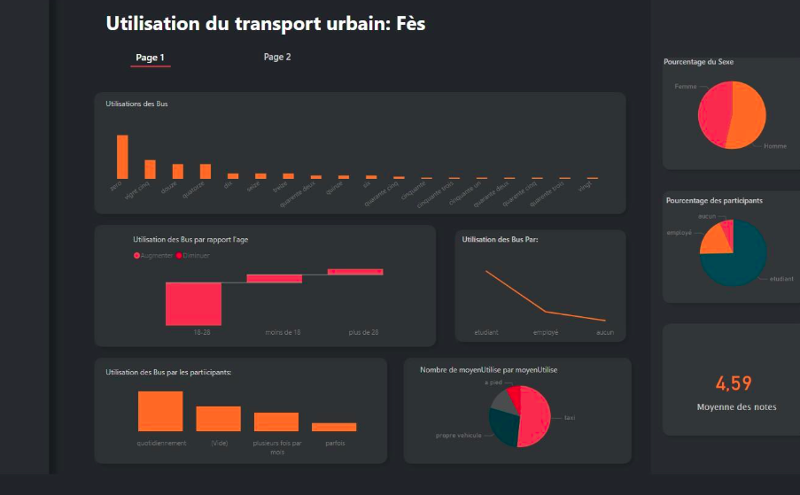
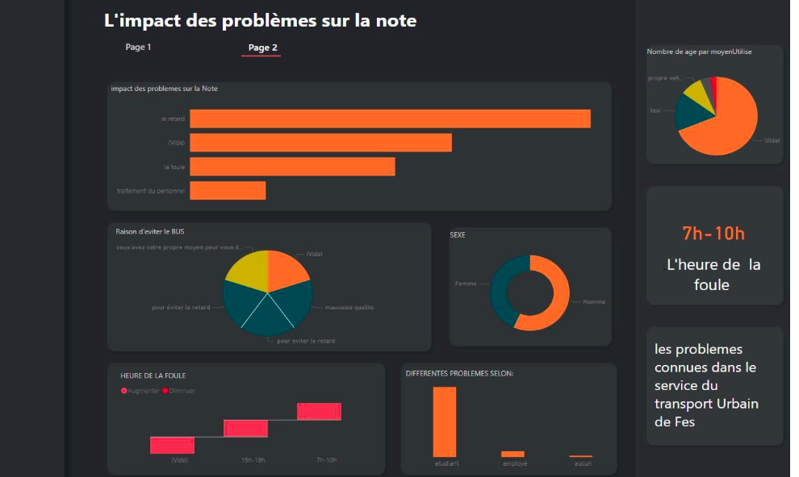

# 🚌 Urban Transport Quality Optimization – Fès

**📄 Description:**
 This project focuses on analyzing and optimizing the quality of urban transport in the city of Fès. The work involved **survey creation, data collection, analysis, and the development of an interactive Power BI dashboard** to identify issues and propose improvements.

**📊 Key Findings:**

- **Students (majority 18–28 years old):**
  - 90% use buses daily
  - Average satisfaction score: 4.91/10
  - Main issues: delays ⏰ and overcrowding, especially between 7–10 AM
- **Employees (majority 18–28 & 28+ years old):**
  - Most prefer taxis over buses 🚕
  - Average satisfaction score: 3.68/10
  - Main issues: delays and limited bus usage
- **Others (neither students nor employees, mostly women):**
  - Prefer taxis over buses 🚖
  - Average satisfaction score: 3.60/10

**🧐 Observations:**

- Delays have the highest impact on user satisfaction and bus avoidance.
- Overcrowding is a common problem, but if buses arrive on time, the satisfaction score remains higher.
- Example: Line 12 has crowding but no major delays, so satisfaction is better.

**💡 Proposed Solutions:**

- Increase the number of buses to accommodate Fès’ population (~1.15 million) 🚍
- Address delays to prevent overcrowding at bus stops
- Monitor peak hours and optimize bus frequency accordingly

**🚀 Learning Outcomes / Experience:**
 This internship was highly enriching:

- Gained practical knowledge of urban transport and its challenges
- Applied theoretical concepts from my studies in real-world scenarios
- Learned the importance of teamwork, cooperation, and adaptability in professional environments
- Developed analytical and visualization skills using **Power BI**

**🛠 Tools / Technologies Used:**

- Power BI 📊

- Data collection via surveys 📝

- Statistical analysis and data processing 🧮

  

  