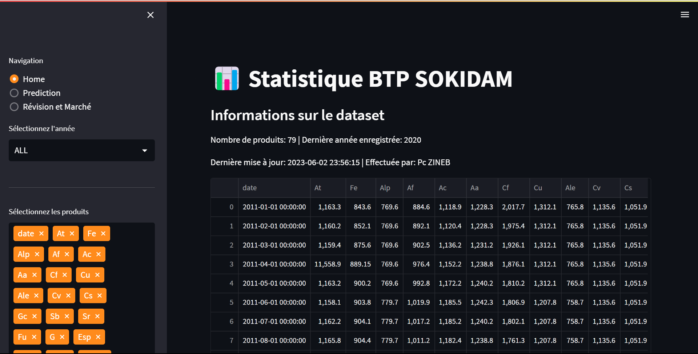

# 🏗️ Construction Materials Price Prediction (Time Series Approach)

## 📌 Project Overview
This project aims to **predict the future prices of construction materials** in order to support better **budget management for construction projects**.  
The analysis is based on **archived historical data (2005–2021)**, extracted and processed from scanned documents.

## ⚙️ Workflow
1. **Data Collection & Extraction**  
   - Imported data from **scanned images** using OCR techniques.  
   - Built an ETL pipeline with **Talend** to clean, transform, and integrate the data.  

2. **Data Preparation**  
   - Data cleaning and preprocessing (handling missing values, normalization, formatting).  
   - Transformation of time series data for modeling.  

3. **Modeling**  
   - Implemented predictive models in **Python** using **SARIMA** and **SARIMAX**.  
   - Achieved a prediction accuracy of **98%**.  

4. **Dashboard & Visualization**  
   - Developed an **interactive dashboard with Streamlit**.  
   - Features:  
     - Visualization of historical and predicted prices.  
     - Automatic calculation of **price revision rates**.  

## 🛠️ Tools & Technologies
- **Languages**: Python  
- **Libraries**: Pandas, NumPy, Statsmodels, Matplotlib, Streamlit  
- **ETL**: Talend  
- **Other**: OCR for data extraction  

## 📊 Results
- Accurate **time series forecasting (98%)**.  
- Interactive dashboard providing insights into **price evolution and revision rates**.  
- Supports construction companies in **budget optimization and project cost management**.  

## 📷 Screenshots

